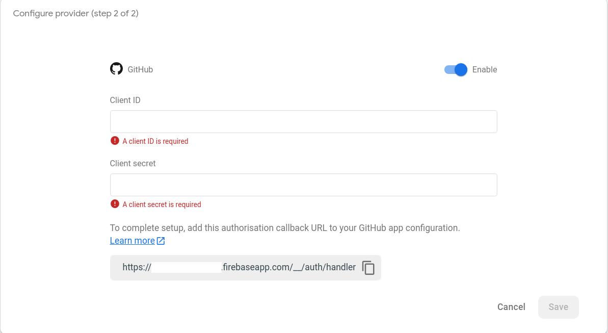
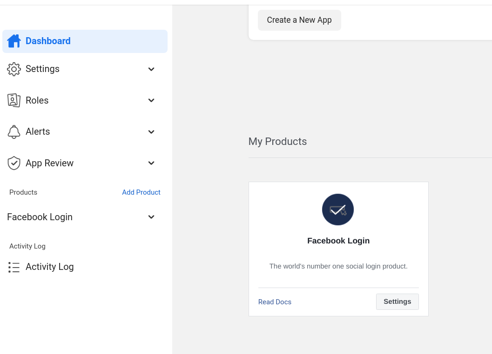
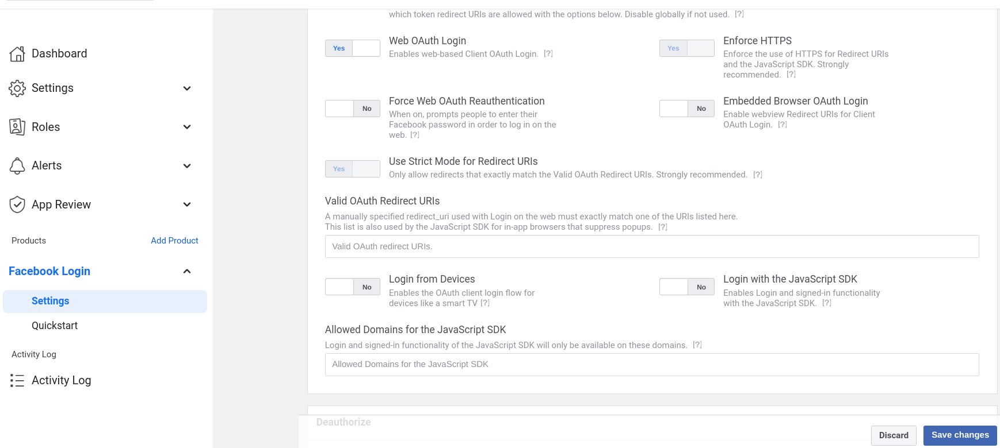
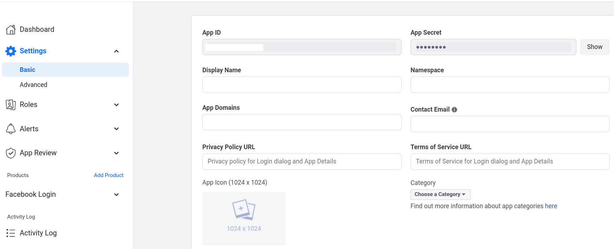

# Next.js + Private Routes + Firebase (Modular SDK 9+)  authentication + Email + Google + Github + Facebook

## Introduction
This demo project showcases how to use Firebase Modular SDK 9+ with Next.js and how to protect routes  that can be visited by only authenticated users.

Once a user has successfully signed in, I have shown some information that you can retrieve of the authenticated user. Like their name, profile picture, email etc.. 

To get even more details, you can read the official Firebase docs. for each OAuth platform and for what more information can be retireved from that authentication provider.

_This project uses **Tailwind CSS** for styling which is completely optional_
***

### To use this project first you need create a new project on Firebase.

After the project has been created, navigate to your project --> Project settings --> Scroll down to get your Firebase project configuration.

***

Git Clone this project on your local system and navigate to the cloned folder.

Redefine these variables in the .env file.

And install the necessary npm dependencies using 
`npm i`

Once that has been completed.

You can run this project in developer mode using
`npm run dev`

**But before doing, that follow the following steps to correctly configure your project for using the mentioned authentication providers**

***

## Enabling Authentication providers.
***

After that, navigate to Authentication section on the left panel and open Sign-in methods tabs.

### Email/Password
***

Click on add new provider and select email/password. 

Enable the **Email/Password** option.

_Do not enable  **Email link (passwordless sign-in)** as in this project I am not using that method._

You can enable it for your own project later but right now I am not using that technique.

Once done with that click on the save button.

### Google Authentication provider
***

Again click on add new provider and select Google.

Enable it and click save.

### Github Authentication provider
***

Again click on add new provider and select GitHub.

Enable the option and then copy the link given that would be given to you at the bottom (above is an example for how it would appear) and navigate to your github profile --> Settings --> Developer Settings --> OAuth Apps --> New OAuth app --> fill in the details for your app and paste the link at the bottom input form.

Once done with that, click on register app.

You'll get "Client ID" and "Client Secret".

Copy them and paste them back in firebase form.

After that click save and github authentication has been added to your project.

### Facebook authentication provider
***
Again click on add new provider and select Facebook.

Copy the link given at the bottom.

Then you need to create your Facebook developer account.
Once that has been created navigate to all apps and create an app.

Select your app type and provide the necessary details for your app and create app.

In dashboard search for Facebook login. 

Go to its settings and paste the copied OAuth redirect link and save changes.

Then in the dashboard navigate back to settings and copy the App ID and App Secret.

